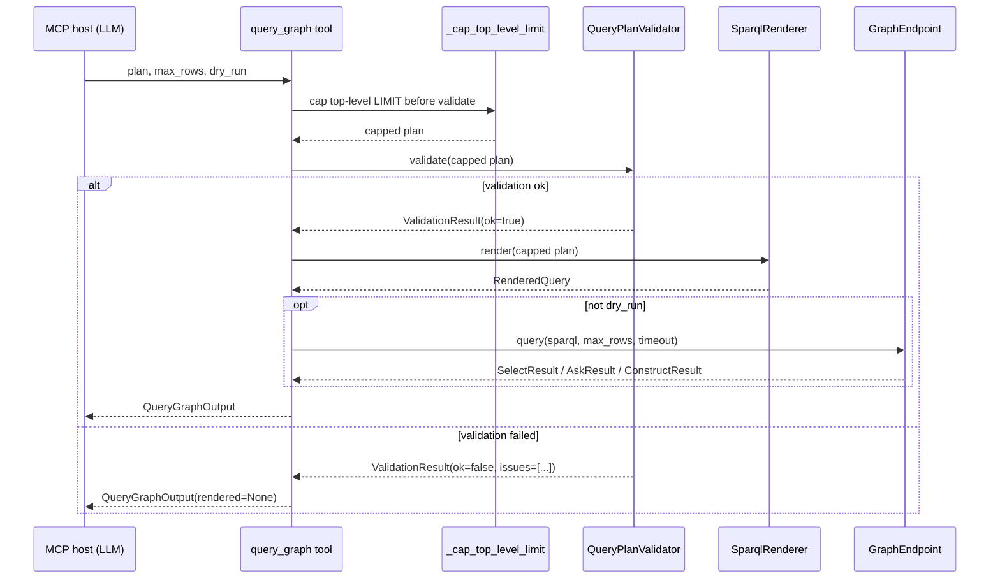

# Architecture

The shape of the system is intentionally narrow:

```mermaid
flowchart TD
    Q[Natural-language question] --> P[LLM / planner]
    P --> IR[QueryPlan IR<br/>(strict Pydantic models)]
    IR --> V[QueryPlanValidator<br/>+ SecurityPolicy]
    V -- ok --> R[SparqlRenderer<br/>(deterministic, escape-safe)]
    V -- errors --> P
    R --> E[GraphEndpoint<br/>(rdflib local / HTTP remote)]
    E --> Res[Normalized QueryResult<br/>(SelectResult / AskResult / ConstructResult)]
    Res --> Host[MCP host returns to user]
```

Each arrow is a deterministic step, not an LLM call. The LLM only
appears at the top — once a `QueryPlan` exists, the rest is plain
software with structured inputs and outputs.

## Why this shape?

Letting an LLM produce raw SPARQL would collapse this diagram into one
arrow ("LLM → endpoint") and trade away every safety, repair, and
auditability property. The IR exists so the validator can speak
*structure*, the renderer can guarantee *escape correctness*, and the
endpoint layer can guarantee *cancellation and truncation*.

See [ADR 0001](/adr/0001-query-plan-ir-not-raw-sparql/) for the full
decision record.

## Layer summary

| Layer | Module | Responsibility |
| --- | --- | --- |
| IR | `graph_mcp/models/_ir.py` | Mutually-recursive Pydantic models for expressions, patterns, and plans. |
| Validator | `graph_mcp/compiler/validator.py` | Static, deterministic checks against `SecurityPolicy`. |
| Renderer | `graph_mcp/compiler/renderer.py` | Plan → canonical SPARQL, with safe escaping. |
| Endpoint | `graph_mcp/graph/endpoint.py` | Read-only execution against rdflib or HTTP. |
| Schema | `graph_mcp/graph/schema_discovery.py` | Cached, best-effort schema snapshot. |
| Resolver | `graph_mcp/graph/term_resolver.py` | Mention → ranked candidate IRIs. |
| Server | `graph_mcp/server.py` + `graph_mcp/mcp_tools/` | FastMCP wiring of tools, resources, and prompts. |
| Security | `graph_mcp/security/policy.py` | Frozen dataclass derived from `Settings`. |

## Data flow inside a single `query_graph` call



Two important details visible in the diagram:

1. The cap runs **before** the validator. That's why a plan with
   `LIMIT 9999` can succeed when the request specifies
   `max_rows=10` — the IR limit is reduced first.
2. `render_sparql` is a separate tool that does **not** cap — it
   validates the user-supplied plan as written. Use it when you want
   the validator to push back on an over-large `LIMIT`.

## Why deterministic validation and rendering?

Deterministic validators give the LLM stable error codes to repair
against. Deterministic renderers produce SPARQL diffs that humans can
review. See [ADR 0002](/adr/0002-deterministic-validator-and-renderer/).

## Where the host LLM enters

Only at three places:

- it produces a `QueryPlan` from a question;
- it consumes structured results from `query_graph`;
- it consumes the `validation.errors` list to repair a rejected plan.

Everything in between is plain code.
