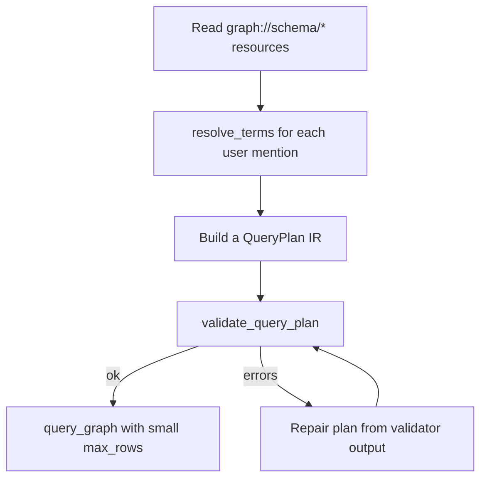

# MCP tools

This page is the user-facing tour. For the schema-level reference (full
input/output, validation behavior, and security notes), see
[Tools reference](/reference/tools-reference/).

## Discovery first

The server registers two kinds of MCP surfaces:

- **Resources** under `graph://...` — read-only metadata about the
  schema and policy. Always start by reading these.
- **Tools** — actions the LLM can call.

The recommended workflow encoded in the `build_query_plan` prompt is:



## resolve_terms

Mention → ranked candidates. Use this whenever the user names something
the LLM does not recognize.

```json
{
  "mentions": ["works for", "Acme"],
  "expected_kinds": ["property", "individual"],
  "limit": 10
}
```

Response is a list of `TermCandidate`s with `iri`, `prefixed_name`,
`label`, `score`, and an `explanation` of why each candidate matched.
Scores below 0.4 are filtered out; if nothing matches a mention, the
response includes a single `kind: "unknown"` placeholder so the LLM
knows to ask a clarifying question.

## validate_query_plan

Static check. Returns a `ValidationResult` with `ok: bool` and a list
of structured `ValidationIssue` records.

```json
{ "plan": { "kind": "select", "where": [], "projection": [] } }
```

Even when `ok` is `true`, you may receive `severity: "warning"`
issues — for example "filter references variables introduced only
inside OPTIONAL". Treat warnings as advisory.

## render_sparql

Validate → render. The output `RenderedQuery` is what the server would
send to the endpoint. Useful for showing the user the SPARQL before
running it.

```json
{ "plan": { "kind": "select", ... } }
```

If validation fails, `rendered` is `null` and `validation` carries the
errors. The tool never fabricates an empty SPARQL string.

## query_graph

Validate → render → execute. You can also pass `dry_run: true` to stop
after rendering. Pass `max_rows` to cap the result set; pass
`timeout_ms` to override the policy timeout.

```json
{
  "plan": { "kind": "select", ... },
  "max_rows": 100,
  "dry_run": false
}
```

`max_rows` is enforced **before** validation, so a plan with `LIMIT
9999` and `max_rows: 10` runs as `LIMIT 10` and validates fine.

## explain_query_plan

Renders a human-readable summary of the plan without executing it.
Handy when the user asks "what would this query do?".

## refresh_schema

Forces (or TTL-gates) a re-discovery of the schema:

```json
{ "force": true }
```

Returns counts and any per-section `diagnostics`. If your endpoint's
schema changes while the server is running, call this to pick up the
new classes/properties.

## execute_sparql_raw (off by default)

When `GRAPH_MCP_ENABLE_RAW_SPARQL=true`, this tool accepts a hand-written
read-only query string. See
[Raw SPARQL mode](/users/raw-sparql-mode/) for the constraints
enforced by the token-aware scanner.

## What you should *not* do

- Don't hand-write SPARQL strings unless raw mode is explicitly
  enabled and you trust the caller.
- Don't invent IRIs — always go through `resolve_terms` so the LLM
  sees real schema candidates.
- Don't skip `validate_query_plan` before executing; the validator
  produces structured errors the LLM can repair from.
